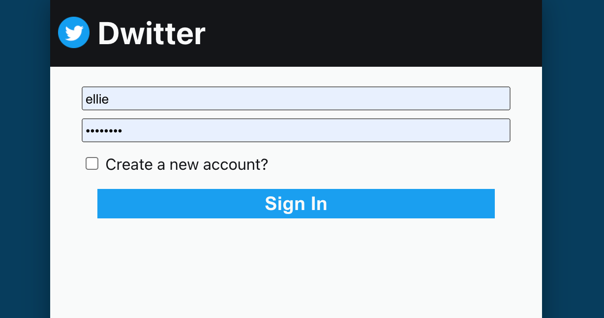
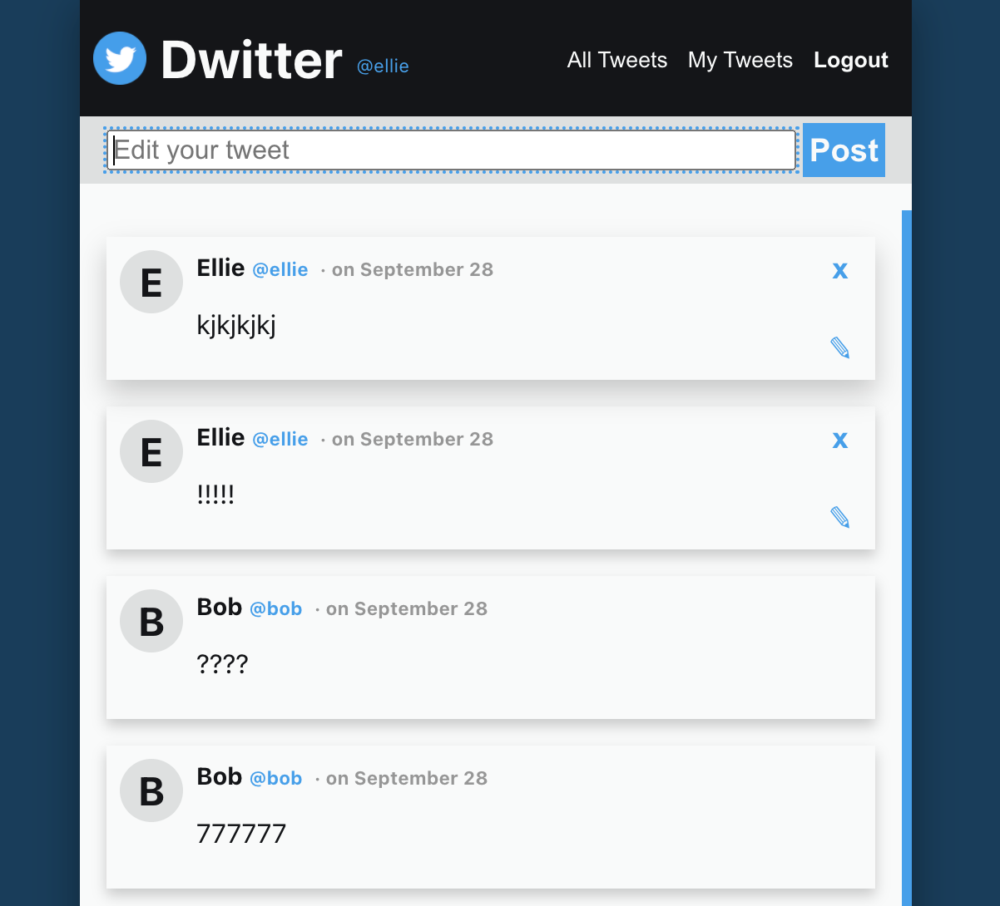

# dwitter2-server

This project is a clone coding project of Twitter <strong>to learn better practice of Node.js</strong> 
🍄 [Link to the page](https://dwitter-ym.netlify.app/)
  

  

## 1. Stacks
- Javascript(Node.js) 
- DB: MySQL - Sequelize
- Deployment: Heroku  
## 2. What it covers
- Auth setup using jsonwebtoken&bcrypt library
- Tweet message CRUD API according to a User account  

## 3. Notion page
- [Link to detail](https://www.notion.so/redpandathome/Dwitter-0bf765a4443e47a99b3253e5db58287d)